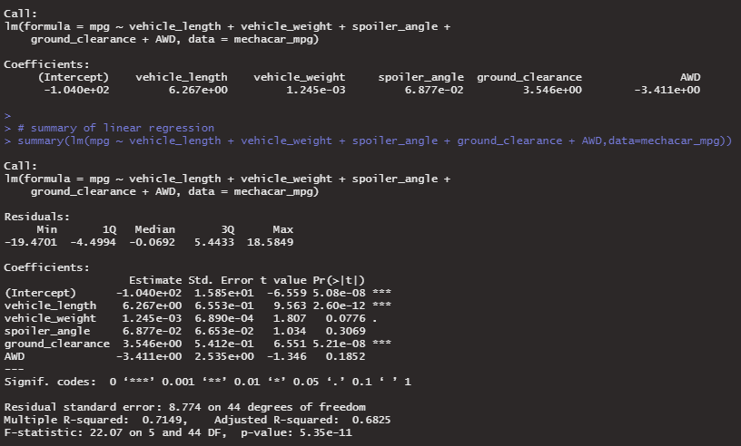
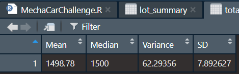
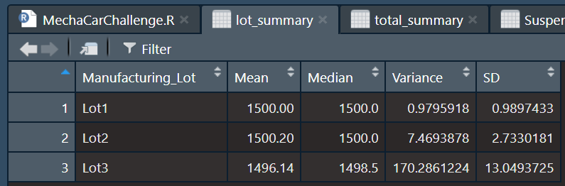
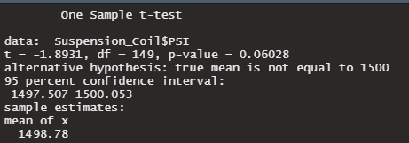
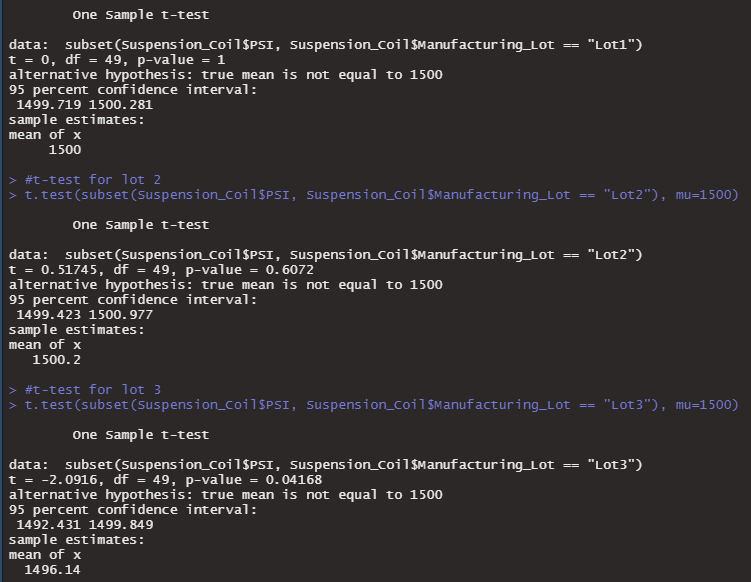

# MechaCar_Statistical_Analysis

## Linear Regression to Predict MPG

For this analysis we performed a linear regression using R’s `lm()` and `summary` functions to see if fuel efficiency in miles per gallon (mpg) can be predicted using a linear model. Multiple vehicle variables (length, weight, spoiler angle, ground clearance and drivetrain) were compared to the mpg variable. 

•	When looking at the p-value, we see that the vehicle length and the ground clearance have non-random amount of variance to the mpg values due to their respective p-values of 2.6e-12 and 5.2e-09, which are well below 0.05 standard threshold and even below a more stringent threshold of 0.001. 

•	With p-value this low, we can have a high level of confidence the slope of the linear model is not equal to zero, therefore the null hypothesis is not true.

•	The r-squared value of 0.7149 tells us there are about 71.5% chance for extrapolated data to fit the model.

## Summary Statistics on Suspension Coils

For the suspension coil analysis, we created a statistic summary using the `summarize` function, where we obtain the mean, median, variance and standard deviation. To obtain statistics by lot, we first grouped by manufacturing lot, then use the same summarize function.

•	According to manufacturing standard for the suspension coils, the variance must not exceed 100 pounds per square inch (PSI). When we look at the total summary, the variance is equal to 62.29, so we could say the suspension coils are manufactured to standard.

•	When we look at the variance for each lot, we notice a value of 170.29 for lot #3, which is above specification and should be rejected. Since the variance is the average of the squared differences from the mean, a few outliers and low sample number can have great effects.

## T-Tests on Suspension Coils

In this analysis, we performed a t-tests to determine if all manufacturing lots and each lot individually are statistically different from the population mean of 1,500 pounds per square inch.

#### T-test for all lots

The t-test for all manufacturing lots had a p-value of 0.06. This means the mean of 1498.78 is not significantly different from the population mean of 1500 PSI when using a threshold of 0.05. Therefore, we cannot reject the null hypothesis.

#### T-test by lot

The t-test for each lot is 1, 0.6072 and 0.04168. This means the mean of 1500 and 1500.2 for lot 1 and 2 are not significantly different from the population mean but the mean of 1496.14 for lot 3 is significantly different. Therefore, it is not random and the manufacturing equipment for that lot may need to be re-qualibrated.

When purchasing a new car, consumers are more and more concerned about the pollution impact, especially in dense cities. How many kilometers can be driven in the city per 100 liters of fuel? It would be interesting to test MechaCar versus the competition for fuel efficiency. The null hypothesis would be that MecharCar and the competitors do not have statistically significant difference in fuel consumption, while the alternative hypothesis would be that MechaCar consume more or less fuel than competitors of the same size category. To test this hypothesis, we could randomly pick 5 cars `(n)` of the exact same model and have them driven on the same commute route during the same 10 days to make sure the weather conditions are the similar. 20 different manufacturers could be compared. Fuel consumption would be precisely measured at the end of the experiment and the averaged results would be subjected to statistical analysis. A on-way ANOVA, where each car model is a category and average fuel consumption a continuous data type, would tell us if there is a difference between any groups but to see if MechaCar specifically is more efficient than the competitors, we would need to look at post-hoc test or perform a t-test between MechaCar and each competitor. 

